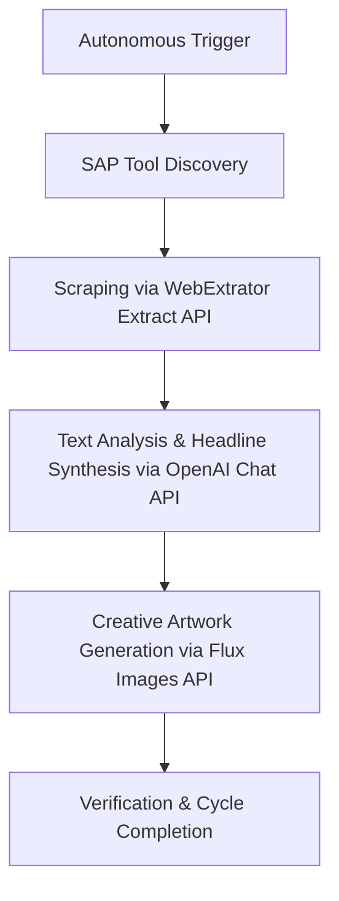

# Autonomous Solana Newsroom Agent (SAP & x402 Integration)

Submitted for **Reward Category 2: Ace Data Cloud Usage (x402 Facilitator)**

---

### Quick Links
* 🎥 **[Live Walkthrough Video](PASTE_YOUR_RECORDED_VIDEO_LINK_HERE)**
* 💻 **[GitHub Repository](https://github.com/binismail/solana-newsroom-agent)**
* 🔑 **Agent Public Wallet:** `CN5KEkSrn89TW79uuPvkgnUYRDTZNHNJ4j2rmwhGWsBR`

---

## 🤖 Core Workflow Overview

The **Autonomous Solana Newsroom Agent** is a production-grade Web3 media agent that autonomously aggregates news, summarizes updates, and designs creative digital artwork for the Solana ecosystem. The entire workflow operates in a fully decentralized, pay-as-you-go paradigm:



### End-to-End Pipeline Steps
1. **Trigger:** The agent initiates a scheduled execution run.
2. **SAP Tool Discovery:** Programmatically discovers active protocol service configurations, USDC settlement settings, and registered PDA configurations on Solana Mainnet-Beta.
3. **Scraping (Ace Data Cloud WebExtrator):** Periodically scrapes Solana's official blog or dev portals to fetch target HTML data and converts it into structured Markdown.
4. **Text Analysis (OpenAI Chat Completion):** Processes the scraped Markdown through LLM completions to generate a punchy headline, structured news summary, and creative visual prompt.
5. **Creative Artwork Gen (Flux Images Generation):** Requests high-quality Flux image generation using the synthesized prompt to act as the primary graphic asset for the news item.
6. **Throttled Termination:** To conserve Ace Data Cloud platform credit metrics and optimize resource efficiency, the execution loop is hard-capped to exactly **3 continuous cycles** (Loops #1, #2, and #3) before gracefully terminating the process via `process.exit(0)`.

---

## 📽️ Walkthrough Video Deliverables

This repository is designed to cleanly satisfy all manual judging requirements. Key agent components demonstrated in the walkthrough video include:

### 🔍 1. Tool Discovery via Synapse Agent Protocol (SAP)
* **On-Chain Registry Queries:** The agent utilizes the `@oobe-protocol-labs/synapse-sap-sdk` library to programmatically fetch registered developer configurations, registry bumps, and active endpoints.
* **Capability Validation:** The program checks capabilities (such as `news-scraping`, `news-analysis`, and `visual-generation`) against active SAP coordination registry endpoints to ensure it discovers valid routing information before starting execution.

### ⚙️ 2. Core Execution
* **Endpoint Pipeline:** The agent sequentially triggers three distinct Ace Data Cloud API endpoints:
  1. **WebExtrator Extract API:** Handles javascript-heavy news sites and formats plain article contents.
  2. **OpenAI Chat Completion:** Evaluates and formats structured JSON containing final headlines and summary contents.
  3. **Flux Images Generation API:** Generates and serves high-definition visual assets.
* **Hybrid Polling Workaround:** Implements a custom polling loop that queries task completion via `finished_at` properties to resolve synchronous and asynchronous generation tasks cleanly, avoiding hanging issues present in standard SDK wait loops.

### ⛓️ 3. On-Chain Registration & Settlement
* **Mainnet PDA Identity:** The agent automatically checks if a registered PDA (`AgentAccount`) is active on Mainnet-Beta. If absent, it submits a transaction to register its identity under the Solana Mainnet-Beta SAP program registry.
* **x402 Payment Interceptor:** 
  * Intercepts standard `402 Payment Required` HTTP response headers returned by the SDK transport layer.
  * Extracted payment payloads are parsed by a custom `KeypairWalletAdapter`.
  * **ATA Auto-Initialization:** If the recipient's Associated Token Account (ATA) does not exist on-chain, the adapter dynamically unshifts a `createAssociatedTokenAccountInstruction` instruction into the Solana transaction to initialize the ATA.
  * **On-Chain Signing & Settlement:** Signs and submits the USDC payment transaction on-chain via the Mainnet-Beta RPC gateway, attaching the confirmed transaction signature to the `X-Payment` request headers to finalize API authentication natively.

---

## 🛠️ Installation & Setup

1. **Clone the Repository:**
   ```bash
   git clone https://github.com/binismail/solana-newsroom-agent.git
   cd solana-newsroom-agent
   ```

2. **Install Dependencies:**
   ```bash
   npm install
   ```

3. **Configure Environment:**
   Create a `.env` file in the root directory:

   * **For on-chain x402 payments (Recommended for Category 2):** Leave `ACEDATACLOUD_API_TOKEN` empty or commented out. Fund the agent's keypair wallet (`CN5KEkSrn89TW79uuPvkgnUYRDTZNHNJ4j2rmwhGWsBR`) with **SOL** (for gas/registration fee) and **USDC** (to settle API calls on-chain).
   * **For API-token billing:** Provide your token in `ACEDATACLOUD_API_TOKEN` (this will bypass X402 as long as token has credits).

   ```env
   SOLANA_NETWORK=mainnet-beta
   SOLANA_RPC_URL=https://api.mainnet-beta.solana.com
   SOLANA_KEYPAIR_PATH=./agent-keypair.json
   # ACEDATACLOUD_API_TOKEN=
   ```

4. **Add Your Wallet Keypair:**
   Save your funded keypair as a JSON array inside a file named `agent-keypair.json` in the root directory.

5. **Build & Run:**
   ```bash
   npm run build
   npm run start
   ```

---

## 🔗 On-Chain Proof & Verification

A complete run log is saved in [`logs/run-2026-05-31T19-49-mainnet.log`](logs/run-2026-05-31T19-49-mainnet.log) showing the full 3-iteration pipeline execution on **Solana Mainnet-Beta**.

### Key On-Chain Addresses

| Resource | Address |
|---|---|
| **Agent Wallet** | [`CN5KEkSrn89TW79uuPvkgnUYRDTZNHNJ4j2rmwhGWsBR`](https://explorer.solana.com/address/CN5KEkSrn89TW79uuPvkgnUYRDTZNHNJ4j2rmwhGWsBR) |
| **Agent PDA (SAP)** | [`FDFUWf9YHkKuPKLnwf9koKGU4aYPBiSz3LTQUtfprxXZ`](https://explorer.solana.com/address/FDFUWf9YHkKuPKLnwf9koKGU4aYPBiSz3LTQUtfprxXZ) |
| **SAP Program** | [`SAPpUhsWLJG1FfkGRcXagEDMrMsWGjbky7AyhGpFETZ`](https://explorer.solana.com/address/SAPpUhsWLJG1FfkGRcXagEDMrMsWGjbky7AyhGpFETZ) |
| **USDC Mint** | [`EPjFWdd5AufqSSqeM2qN1xzybapC8G4wEGGkZwyTDt1v`](https://explorer.solana.com/address/EPjFWdd5AufqSSqeM2qN1xzybapC8G4wEGGkZwyTDt1v) |

### Sample X402 USDC Payment Transactions

| # | Solana Explorer Link |
|---|---|
| 1 | [`5MxeguRh...`](https://explorer.solana.com/tx/5MxeguRhK9mFnG2cfB8yYzAGnMi3yLXC1phYjQ2Le8kRqjMY3qkX6XoWbUrJNkHJtRtPQ8wHRbGCu5n2ykKptCjM) |
| 2 | [`2rrRgbDj...`](https://explorer.solana.com/tx/2rrRgbDjQ7SZtgh1CmKRrNtmnkbzbgsaUd8wokyNK1TcxxWC9hv2ZRzEse8doMfWi7feBUftHL5JRiiXNNZkjj5x) |
| 3 | [`4n64TLxg...`](https://explorer.solana.com/tx/4n64TLxgLZudvV3cDnfXhPMr7DCcmoBCeLdSWvx1M2vBzAY8rkHzDrFZjsyxc77C1qUrLYGHZimdpE413CcW4U2Y) |
| 4 | [`3afvGKxB...`](https://explorer.solana.com/tx/3afvGKxBsgWcPCQAz4XtaMoou52owTtz1XRP8Haqhre81ukwXH2h729X84nsQmu36SQT8MEXkQVTTNLJuoKiKoVJ) |

### SAP Stats Report Transactions

| # | Solana Explorer Link |
|---|---|
| 1 | [`4RzDvPqc...`](https://explorer.solana.com/tx/4RzDvPqc339wr6Ujs5reM7xRS8FvpV5dp4e1g6Dj7HWSLNsrunv69L3XZy6qLv4PhSM42geJr3rLPMAt2R5kgegu) |
| 2 | [`4XpSATta...`](https://explorer.solana.com/tx/4XpSATtaY27g19ztAEmwPN8V5T8KZWDmSm13HhQa2QrAAFtyHPBtm59U3SdVQoUzCmTKbZz65LDaJW372aFJAaR4) |
